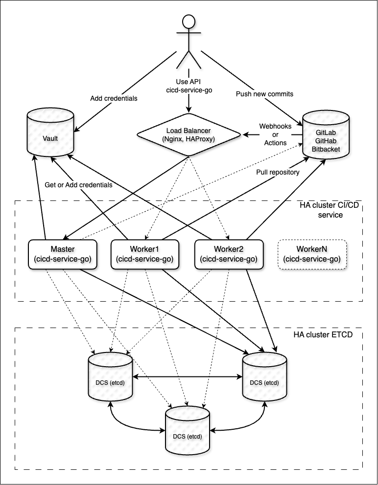

High-Aviability cicd-service-go
===

Сервис высокой доступности для построения CI/CD конвейера.

### Описание docker compose файлов для локального разворачивания

| docker                    | Описание                                                       |
|---------------------------|----------------------------------------------------------------|
| **docker-compose.yml**    | Разворачивание etcd                                            |
| **docker-compose-ha.yml** | Разворачивание etcd и кластер из трех экземпляров cicd сервиса |

### Supported setups of CI/CD cluster

